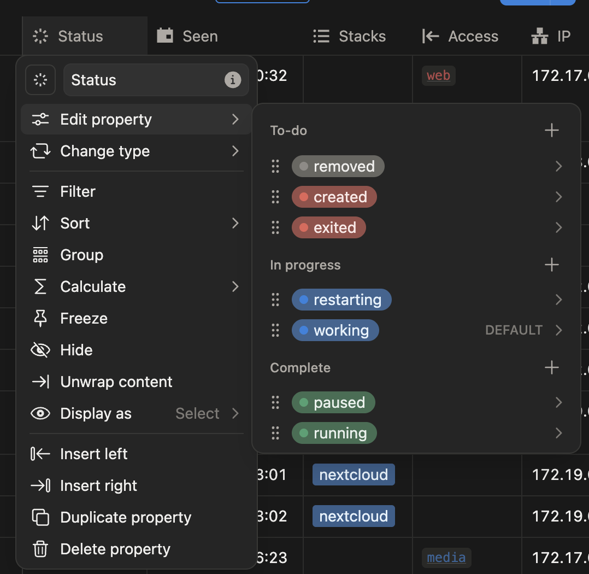

# 🐋 Docker-2-Notion (D2N)

**"도커 컨테이너 관리가 귀찮아서 만든 노션 자동 동기화 도구"** > 터미널에서 `docker ps`를 치는 대신, 익숙한 Notion 대시보드에서 실시간으로 컨테이너 상태를 확인하세요.

[💡 주요 특징](#-주요-특징)

[🛠 Notion 사전 준비](#-notion-사전-준비)

[🚀 사용 방법 (Docker Label)](#-사용-방법-docker-label)

[🏗 프로젝트 구조](#-프로젝트-구조)

[💡 개발자 팁](#-개발자-팁)

[🗿 마일스톤](#-마일스톤)

## 💡 주요 특징

* **실시간 이벤트 모니터링:** `create` `start` `stop` `die` 등 도커 이벤트를 실시간으로 감지하여 노션에 즉시 반영합니다.

* **라벨 기반 필터링:** 모든 컨테이너가 아닌, `d2n.enabled=true` 라벨이 붙은 컨테이너만 골라서 관리합니다.

* **멀티 데이터베이스 지원:** 컨테이너마다 서로 다른 노션 DB로 상태를 보낼 수 있습니다.

* **스마트 캐싱:** 페이지 ID를 로컬에 캐싱하여 노션 API 호출을 최소화하고 성능을 높였습니다.

* **컬러풀 로깅:** Docker, Notion, Cache 등 모듈별로 색상이 구분된 직관적인 로그를 제공합니다.

## 🛠 Notion 사전 준비

* Notion API 토큰을 발급받고, 데이터베이스가 있는 페이지에 권한을 부여합니다.

* Database에는 아래의 속성이 반드시 있어야 합니다.

    * **Name:** `title`

    * **Image:** `rich_text`

    * **Stacks:** `multi_select` (docker-compose 사용 시. 옵션은 자동 생성됨)

    * **Status:** `status`

      

      | 노션 Status 값 | 관련 도커 이벤트/상태 | 의미 |
      | --- | --- | --- |
      | running | start | 컨테이너가 정상적으로 가동 중인 상태 |
      | exited | stop, die | 컨테이너 프로세스가 종료되어 멈춘 상태 |
      | removed | destroy | 컨테이너가 삭제되어 더 이상 존재하지 않는 상태 |
      | restarting | restarting | 컨테이너가 재시작 루프에 빠졌거나 다시 켜지는 중 |
      | created | create | 컨테이너가 생성되었으나 아직 실행 전인 상태 |
      | paused | paused | 컨테이너가 일시 정지된 상태 |

    * **IP:** `rich_text`

    * **Ports:** `rich_text`

    * **Created:** `date`

    * **Seen:** `date`

## 🚀 사용 방법 (Docker Label)

### 1. 대상 컨테이너 라벨 설정

* 모니터링을 원하는 컨테이너 실행 시 아래 라벨을 추가합니다.

* `d2n.enabled=true`: 해당 컨테이너를 노션 동기화 대상으로 지정합니다.

* `d2n.database=이름`: `config.yaml`에 정의한 데이터베이스 name을 입력합니다. (미지정 시 기본 DB 사용)

### 2. 호스트 설정 파일 준비

* 보안을 위해 `.env` 파일 대신 런타임 환경 변수를 사용합니다. 설정 파일과 로그는 호스트의 홈 디렉토리에서 관리합니다.

* `config/` 디렉토리에 있는 `config.yaml.example` 파일을 복사하여 실제 설정 파일을 작성하면 더 쉽습니다.

  ```Bash
  # 1. 홈 디렉토리에 설정 폴더 생성
  mkdir -p ~/d2n/config ~/d2n/logs ~/d2n/data

  # 2. Database 목록 설정 (config.yaml 작성)
  # ~/d2n/config/config.yaml 경로에 아래 내용 작성
  targets:
    default: "example"
    databases:
      - name: "example"
        database_id: "DATABASE_ID_HERE"
      - name: "Kanade"
        database_id: "KANADE_DATABASE_ID_HERE"
      - name: "Su"
        database_id: "SU_DATABASE_ID_HERE"
  ```

### 3. 프로그램 빌드 및 실행

* 민감한 API 키는 실행 시점에 `-e` 옵션으로 안전하게 주입합니다.

  | 환경 변수 | 설명 | 기본 값 | 사용 예시 |
  | --- | --- | --- | --- |
  | `NOTION_API_KEY` | Notion API 토큰 |  | `your_notion_api_key_here` | 
  | `DOCKER_API_URL` | Docker API URL |  | `tcp://host.docker.internal:2375` |
  | `LOG_LEVEL` | 로그 레벨 | `INFO` | `DEBUG`, `INFO`, `WARNING`, `ERROR` |
  | `TZ` | 타임존 설정 | `Asia/Seoul` | `Asia/Japan`, `America/New_York` |

* 도커 이미지를 빌드하고, 필요한 볼륨과 환경 변수를 주입하여 컨테이너로 실행합니다.

  ```Bash
  # 1. 이미지 빌드 (v0.1.0-beta4)
  docker build . -t d2n:beta4

  # 2. 실행 (환경 변수 주입 및 볼륨 마운트)
  docker run -d \
    --name d2n-service \
    --restart unless-stopped \
    -v /var/run/docker.sock:/var/run/docker.sock \
    -v ~/d2n/config:/app/config \
    -v ~/d2n/logs:/app/logs \
    -v ~/d2n/data:/app/data \
    -e DOCKER_API_URL="unix:///var/run/docker.sock" \
    -e NOTION_API_KEY="your_notion_api_key_here" \
    -e LOG_LEVEL="INFO" \
    -e TZ="Asia/Seoul" \
    --label "d2n.enabled=true" \
    --label "d2n.database=Docker" \
    d2n:beta4
  ```

## 🏗 프로젝트 구조

* **main.py:** 프로그램이 시작되면 초기 동기화를 수행하고, 도커 이벤트를 실시간으로 감시하여 상태 변화를 노션에 즉시 반영합니다. 또한, `SIGINT` 및 `SIGTERM` 신호를 처리하여 프로그램이 안전하게 종료될 수 있도록 돕습니다.

* **config/settings.py:** 시스템 환경 변수를 최우선으로 참조하며 (필요시 `.env`), `config.yaml` 설정을 로드해 DB 매핑·타임존 등을 통합 관리·검증합니다. 전역 싱글톤 대신 `load_settings()` 팩토리로 명시적으로 로드하며, `resolve_db_id()`로 `d2n.database` 라벨(이름)을 실제 DB ID로 해석합니다.

* **src/models.py:** 도커에서 가공한 데이터 (상태, IP, 포트, 이미지, 생성 시각, 전용 라벨 등)를 프로그램 내부에서 일관되게 다루기 위한 표준 Dataclass를 정의합니다.

* **src/status.py:** Docker 상태 문자열을 Notion `Status` 옵션 값으로 정규화하는 매핑을 한 곳에 모읍니다.

* **src/docker_client.py:** 도커 데몬으로부터 실행 중인 컨테이너 정보를 수집합니다. 멀티 네트워크 IP, 포트 바인딩 IP(IPv4), host 네트워크, 동기화 전용 라벨(`d2n.enabled`, `d2n.database`)을 파싱하며, 파싱 로직은 SDK 호출과 분리된 순수 함수로 구현되어 단위 테스트가 가능합니다.

* **src/notion_client.py:** 도커에서 추출한 정보를 바탕으로 노션 데이터베이스 속성에 맞춰 데이터를 변환하고 API를 통해 동기화합니다.

* **src/cache_manager.py:** 노션 페이지 ID를 로컬 JSON 파일에 저장하고 관리합니다. 300초의 유효 시간을 두어 노션 API의 중복 호출을 방지합니다.

* **src/logger.py:** 모듈 이름별로 다른 색상의 로그를 출력하여 디버깅 편의성을 높이고, 모든 로그를 파일로 기록합니다. 장기 실행 데몬을 고려해 자정마다 `YYYY-MM-DD.log`로 로테이션합니다.

## 💡 개발자 팁

* **IP 주소:** 컨테이너가 연결된 **모든 네트워크**의 IP를 `IP: 네트워크` 형태로, **IP 숫자값 오름차순**으로 정렬해 표시합니다. `--network host` 모드는 `host`로 표기합니다.

* **포트 정보:** IPv6를 제외하고, **어떤 호스트 IP에서 접근 가능한지**까지 보여줍니다.

    * 전체 노출(`0.0.0.0`/기본): `80 → 8080/tcp` (IP 생략)

    * 특정 IP 바인딩: `5432 → 127.0.0.1:5432/tcp`

    * 노출만 됨(EXPOSE, 호스트 미바인딩): `9000/tcp`

* **상태 정규화:** Docker의 `dead`/`removing` 같은 상태도 Notion 옵션(`exited`/`removed`)으로 자동 변환되어 업데이트 실패를 방지합니다.

* **스택 자동 태깅:** docker-compose 프로젝트(`com.docker.compose.project`, Swarm은 `com.docker.stack.namespace`) 이름을 `Stacks`(multi_select) 속성에 자동으로 채웁니다. 없던 옵션은 Notion이 자동 생성하며, 스택이 없는 단독 컨테이너는 해당 속성을 건드리지 않아 수동 입력값을 보존합니다.

* **자동 재연결:** Docker 이벤트 스트림이 끊겨도 백오프 후 자동 재연결하고, 재연결 직후 전체 상태를 다시 동기화하여 놓친 변화를 보정합니다.

* **캐시 무효화:** 노션에서 페이지를 수동으로 삭제(404)하면 이를 감지해 캐시를 비우고 재생성합니다. 일시적인 API 오류(429/5xx)는 재시도하며, 실패해도 캐시를 유지한 채 건너뛰어 중복 페이지 생성을 막습니다.

## 🗿 마일스톤

* [X] **Docker API 버전 업데이트 및 SDK 전환**

* [X] **객체 지향 기반 클래스 분리 (Docker, Notion, Cache)**

* [X] **라벨 기반 필터링 및 DB 라우팅 로직 구현**

* [X] **JSON 기반 5분 TTL 캐시 시스템 도입**

* [x] **destroy 이벤트 감지 및 removed 상태 처리 구현**

* [X] `Dockerfile`: **`.env` 제거, 환경 변수 기본값 설정, logs/config/data 볼륨 구성 완료**

* [X] `settings.py`: **시스템 환경 변수 우선순위 로직 적용**

* [X] **멀티 네트워크 IP / 포트 바인딩 IP / host 네트워크 표기 지원**

* [X] **Image·Created 필드 추가**

* [X] **Python 3.14 전환 및 문법 현대화**

* [X] **Notion 재시도/백오프·404 구분, Docker 이벤트 자동 재연결**

* [X] **설정 의존성 주입(DI) 및 pytest 단위 테스트 도입**

* [ ] **Jenkinsfile 기반의 선언적 CI/CD 파이프라인 구축**

* [ ] **Webhook 연동을 통한 Git Push 기반 자동 배포 검증**